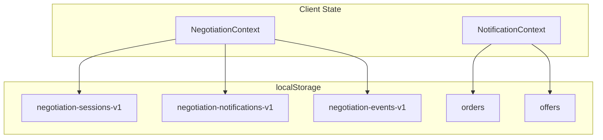
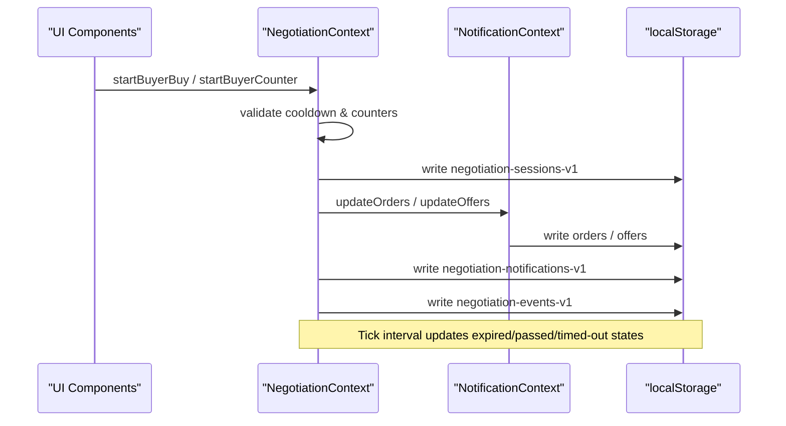
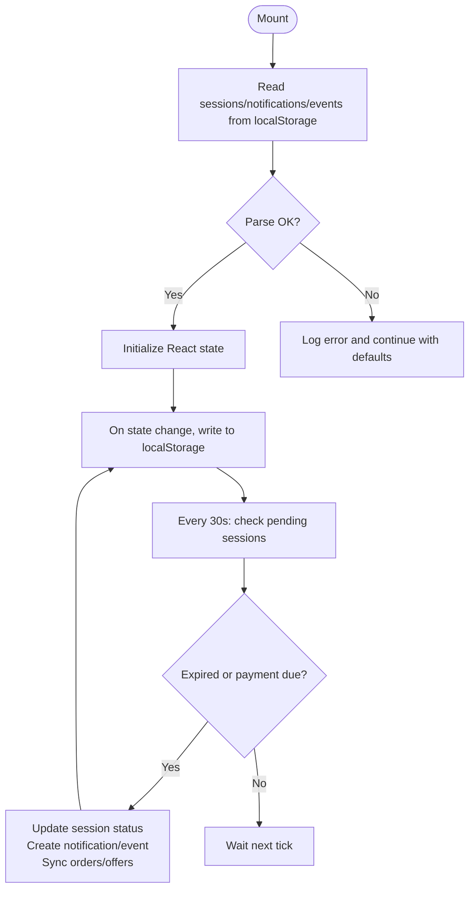
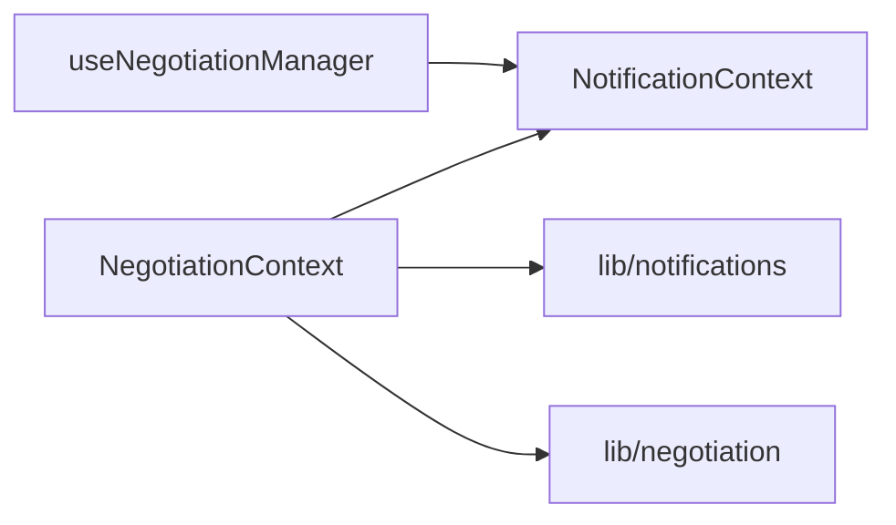
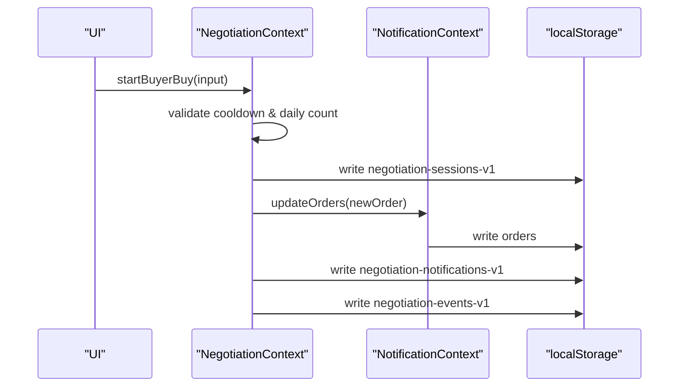
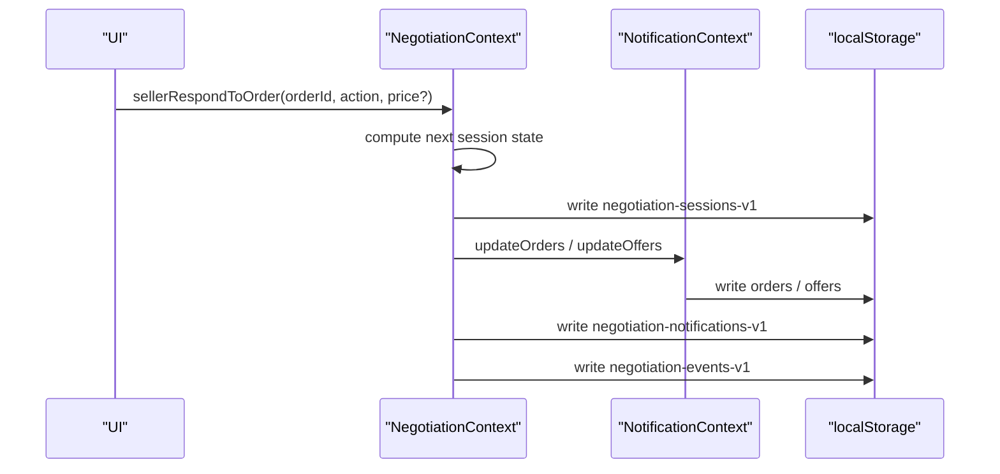

# Persistence Strategy

<cite>
**Referenced Files in This Document**
- [NegotiationContext.tsx](file://src/context/NegotiationContext.tsx)
- [NotificationContext.tsx](file://src/context/NotificationContext.tsx)
- [notifications.ts](file://src/lib/notifications.ts)
- [negotiation.ts](file://src/lib/negotiation.ts)
- [useNegotiationManager.ts](file://src/hooks/useNegotiationManager.ts)
- [types.ts](file://src/types.ts)
</cite>

## Table of Contents
1. [Introduction](#introduction)
2. [Project Structure](#project-structure)
3. [Core Components](#core-components)
4. [Architecture Overview](#architecture-overview)
5. [Detailed Component Analysis](#detailed-component-analysis)
6. [Dependency Analysis](#dependency-analysis)
7. [Performance Considerations](#performance-considerations)
8. [Troubleshooting Guide](#troubleshooting-guide)
9. [Conclusion](#conclusion)
10. [Appendices](#appendices)

## Introduction
This document explains the client-side persistence strategy used by PortVille Market to keep negotiation sessions, notifications, and events alive across browser sessions using localStorage. It details the storage keys, serialization/deserialization flow, data migration approach for schema changes, and best practices for integrity and error handling. It also covers security considerations and alternatives for storing sensitive data, plus troubleshooting guidance for common issues like quota exceeded errors and corrupted data.

## Project Structure
The persistence logic is primarily implemented in two React contexts:
- NegotiationContext: persists negotiation sessions, notifications, and events with versioned keys.
- NotificationContext: persists orders and offers with simple keys.

**Diagram sources**
- [NegotiationContext.tsx:72-74](file://src/context/NegotiationContext.tsx#L72-L74)
- [NegotiationContext.tsx:146-173](file://src/context/NegotiationContext.tsx#L146-L173)
- [NotificationContext.tsx:29-85](file://src/context/NotificationContext.tsx#L29-L85)

**Section sources**
- [NegotiationContext.tsx:72-74](file://src/context/NegotiationContext.tsx#L72-L74)
- [NegotiationContext.tsx:146-173](file://src/context/NegotiationContext.tsx#L146-L173)
- [NotificationContext.tsx:29-85](file://src/context/NotificationContext.tsx#L29-L85)

## Core Components
- NegotiationContext manages:
  - Sessions (negotiation-sessions-v1)
  - Notifications (negotiation-notifications-v1)
  - Events (negotiation-events-v1)
  - A tick-based timer that ages out pending states and syncs to orders/offers
- NotificationContext manages:
  - Orders (orders)
  - Offers (offers)
  - Seen flags for UI badges

Key responsibilities:
- Load persisted state on mount
- Persist state changes immediately
- Enforce business rules (cooldowns, counters, timeouts)
- Keep cross-context state consistent (sessions ↔ orders ↔ offers)

**Section sources**
- [NegotiationContext.tsx:140-179](file://src/context/NegotiationContext.tsx#L140-L179)
- [NotificationContext.tsx:22-85](file://src/context/NotificationContext.tsx#L22-L85)

## Architecture Overview
The system uses a dual-context architecture with localStorage as the durable store. Each context owns its own keys and serializes JSON. The negotiation context drives lifecycle transitions and emits notifications/events, while the notification context tracks orders/offers visible to users.

**Diagram sources**
- [NegotiationContext.tsx:267-317](file://src/context/NegotiationContext.tsx#L267-L317)
- [NegotiationContext.tsx:181-252](file://src/context/NegotiationContext.tsx#L181-L252)
- [NotificationContext.tsx:64-85](file://src/context/NotificationContext.tsx#L64-L85)

## Detailed Component Analysis

### NegotiationContext Persistence
- Storage keys:
  - negotiation-sessions-v1
  - negotiation-notifications-v1
  - negotiation-events-v1
- Initialization:
  - On mount, reads from localStorage and parses JSON into state
  - Errors during load are caught and logged; app continues with empty state
- Writes:
  - After any state change, writes back to localStorage synchronously
- Lifecycle:
  - A 30-second interval checks pending sessions and marks them passed or timed-out based on age and payment deadlines
  - When transitioning, it creates notifications and events and syncs order/offer statuses

**Diagram sources**
- [NegotiationContext.tsx:146-173](file://src/context/NegotiationContext.tsx#L146-L173)
- [NegotiationContext.tsx:181-252](file://src/context/NegotiationContext.tsx#L181-L252)

**Section sources**
- [NegotiationContext.tsx:72-74](file://src/context/NegotiationContext.tsx#L72-L74)
- [NegotiationContext.tsx:146-173](file://src/context/NegotiationContext.tsx#L146-L173)
- [NegotiationContext.tsx:181-252](file://src/context/NegotiationContext.tsx#L181-L252)

### NotificationContext Persistence
- Storage keys:
  - orders
  - offers
- Initialization:
  - Reads arrays from localStorage and validates they are arrays before setting state
  - Parses errors are caught and logged
- Writes:
  - updateOrders/updateOffers persist new arrays to localStorage
- UI state:
  - Tracks seen flags for badge indicators and resets when lists change

**Section sources**
- [NotificationContext.tsx:29-85](file://src/context/NotificationContext.tsx#L29-L85)
- [NotificationContext.tsx:95-116](file://src/context/NotificationContext.tsx#L95-L116)

### Data Models and Helpers
- AppNotification and helpers:
  - createNotification adds id, createdAt, read=false
  - addNotification limits history to last 20 items
  - markAllNotificationsRead sets all to read
- NegotiationEvent:
  - createNegotiationEvent builds event entries with timestamps
- Types:
  - Order and Offer types define fields persisted via NotificationContext

**Section sources**
- [notifications.ts:17-42](file://src/lib/notifications.ts#L17-L42)
- [negotiation.ts:20-38](file://src/lib/negotiation.ts#L20-L38)
- [types.ts:1-48](file://src/types.ts#L1-L48)

## Dependency Analysis
- NegotiationContext depends on:
  - NotificationContext for orders/offers synchronization
  - lib/notifications for creating and managing notifications
  - lib/negotiation for building events
- NotificationContext is independent and provides shared orders/offers state
- useNegotiationManager composes actions over NotificationContext but does not directly touch localStorage

**Diagram sources**
- [NegotiationContext.tsx:5-7](file://src/context/NegotiationContext.tsx#L5-L7)
- [useNegotiationManager.ts:6-8](file://src/hooks/useNegotiationManager.ts#L6-L8)

**Section sources**
- [NegotiationContext.tsx:5-7](file://src/context/NegotiationContext.tsx#L5-L7)
- [useNegotiationManager.ts:6-8](file://src/hooks/useNegotiationManager.ts#L6-L8)

## Performance Considerations
- Synchronous writes: Every state mutation triggers a synchronous localStorage write. For high-frequency updates, consider batching or debouncing to reduce I/O overhead.
- Interval cost: The 30-second tick iterates all sessions; ensure session counts remain reasonable.
- Array slicing: Notifications are capped at 20 entries to limit size growth.
- JSON parsing: Parsing occurs on mount; wrap in try/catch to avoid blocking startup.

[No sources needed since this section provides general guidance]

## Troubleshooting Guide
Common issues and remedies:
- Quota exceeded:
  - Symptom: Unhandled exceptions when writing to localStorage
  - Mitigation: Implement quota checks before writes and clear older data (e.g., truncate events or notifications)
  - Recovery: Provide a “Reset local data” action to clear corrupted or oversized stores
- Corrupted data:
  - Symptom: JSON parse errors on load
  - Current behavior: Errors are caught and logged; app continues with default state
  - Improvement: Add schema validation and fallback to defaults per key
- Stale or inconsistent state:
  - Symptom: Orders/offers not matching sessions after refresh
  - Check: Ensure both contexts write their respective keys and that tick logic runs
  - Fix: Re-run refresh or clear localStorage for affected keys

Security considerations:
- localStorage is accessible to all scripts on the page and is not encrypted. Avoid storing secrets or tokens.
- If sensitive data must be stored client-side, prefer secure mechanisms such as:
  - HttpOnly cookies for authentication tokens
  - Web Crypto API for encrypting payloads before storing in localStorage
  - IndexedDB with encryption for larger datasets
  - Secure server-side storage for sensitive records

Data migration strategy:
- Versioned keys:
  - negotiation-sessions-v1, negotiation-notifications-v1, negotiation-events-v1 indicate schema versions
- Migration pattern:
  - On load, detect current version and transform legacy formats to the latest schema
  - Example steps:
    - Read old key (e.g., without version suffix)
    - Normalize fields to match current model
    - Write normalized data to versioned key
    - Optionally remove legacy key
- Integrity checks:
  - Validate required fields and ranges
  - Reset invalid entries to safe defaults
  - Log migration outcomes for debugging

Implementing similar persistence for new features:
- Define a versioned storage key
- Create a loader function that:
  - Reads the versioned key
  - Parses and validates data
  - Applies migrations if needed
  - Sets React state
- Create a writer function that:
  - Serializes state to JSON
  - Writes to localStorage
  - Handles quota and parse errors gracefully
- Integrate with existing contexts or create a dedicated context for the feature

**Section sources**
- [NegotiationContext.tsx:146-173](file://src/context/NegotiationContext.tsx#L146-L173)
- [NotificationContext.tsx:29-85](file://src/context/NotificationContext.tsx#L29-L85)
- [notifications.ts:26-28](file://src/lib/notifications.ts#L26-L28)

## Conclusion
PortVille Market’s client-side persistence relies on versioned localStorage keys to maintain negotiation sessions, notifications, and events across browser sessions. The NegotiationContext orchestrates lifecycle transitions and keeps orders/offers in sync via NotificationContext. While effective for non-sensitive data, developers should adopt robust migration, validation, and error-handling patterns, and consider more secure storage options for sensitive information.

[No sources needed since this section summarizes without analyzing specific files]

## Appendices

### Storage Keys Reference
- negotiation-sessions-v1: negotiation sessions
- negotiation-notifications-v1: application notifications
- negotiation-events-v1: negotiation event log
- orders: buyer/seller orders
- offers: buyer/seller offers

**Section sources**
- [NegotiationContext.tsx:72-74](file://src/context/NegotiationContext.tsx#L72-L74)
- [NotificationContext.tsx:36-58](file://src/context/NotificationContext.tsx#L36-L58)

### Key Workflows

#### Buyer initiates a buy request

**Diagram sources**
- [NegotiationContext.tsx:267-317](file://src/context/NegotiationContext.tsx#L267-L317)
- [NotificationContext.tsx:64-69](file://src/context/NotificationContext.tsx#L64-L69)

#### Seller responds to an order

**Diagram sources**
- [NegotiationContext.tsx:380-512](file://src/context/NegotiationContext.tsx#L380-L512)
- [NotificationContext.tsx:71-76](file://src/context/NotificationContext.tsx#L71-L76)