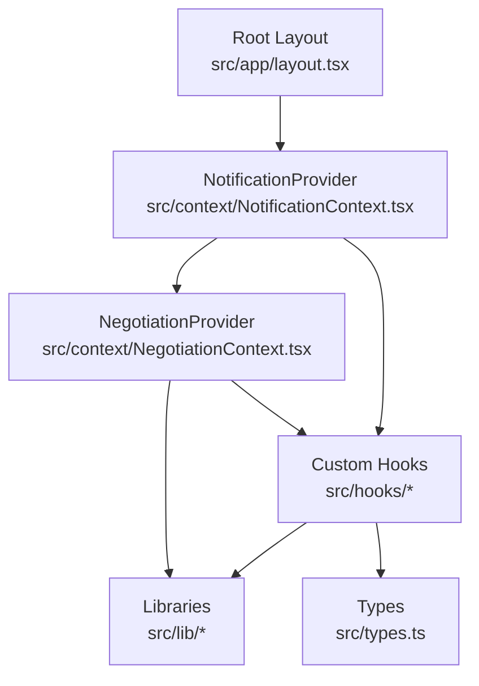
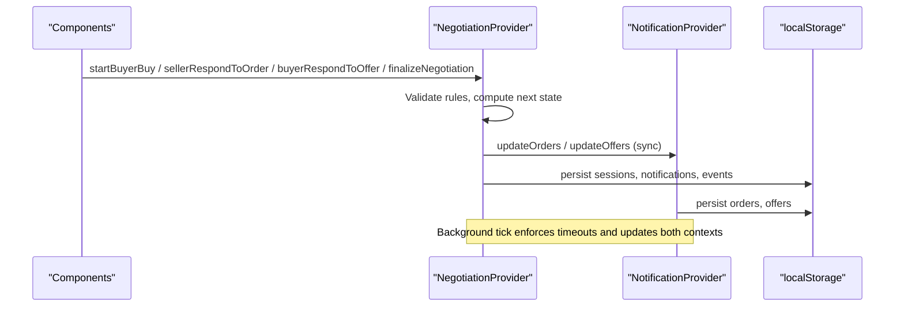
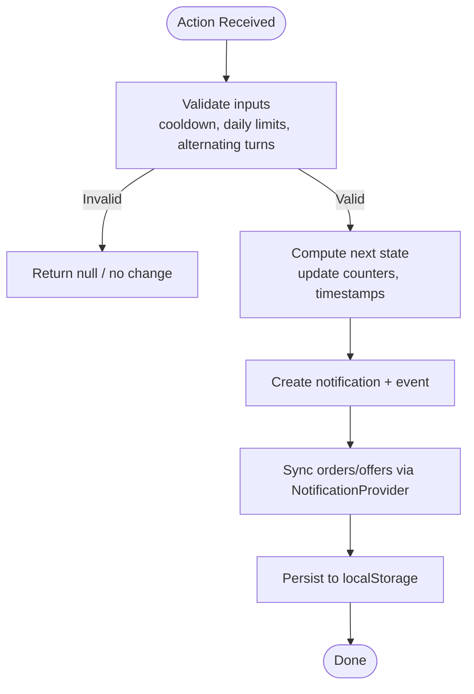
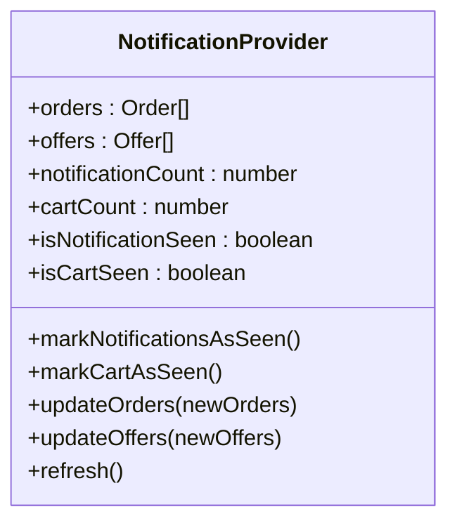
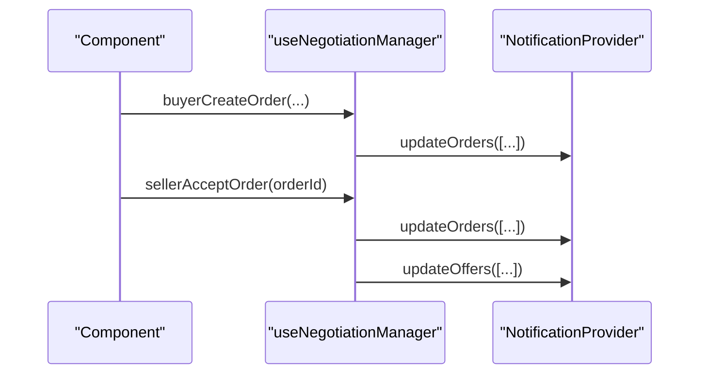
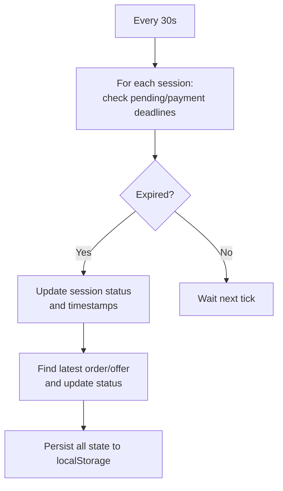
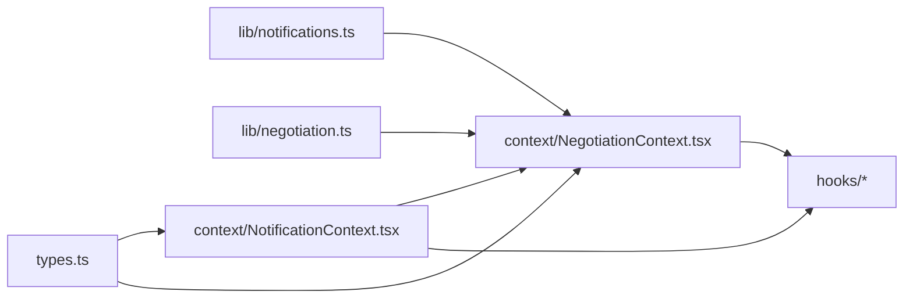

# State Management

<cite>
**Referenced Files in This Document**
- [layout.tsx](file://src/app/layout.tsx)
- [NegotiationContext.tsx](file://src/context/NegotiationContext.tsx)
- [NotificationContext.tsx](file://src/context/NotificationContext.tsx)
- [useNegotiationManager.ts](file://src/hooks/useNegotiationManager.ts)
- [useNotification.ts](file://src/hooks/useNotification.ts)
- [notifications.ts](file://src/lib/notifications.ts)
- [negotiation.ts](file://src/lib/negotiation.ts)
- [types.ts](file://src/types.ts)
</cite>

## Table of Contents
1. [Introduction](#introduction)
2. [Project Structure](#project-structure)
3. [Core Components](#core-components)
4. [Architecture Overview](#architecture-overview)
5. [Detailed Component Analysis](#detailed-component-analysis)
6. [Dependency Analysis](#dependency-analysis)
7. [Performance Considerations](#performance-considerations)
8. [Troubleshooting Guide](#troubleshooting-guide)
9. [Conclusion](#conclusion)
10. [Appendices](#appendices)

## Introduction
This document explains PortVille Market’s state management architecture with a focus on:
- Global state via React Context API for negotiation sessions and notifications
- A negotiation state machine with states, transitions, and timeout handling
- A notification system for user feedback and real-time updates
- Custom hooks that encapsulate complex state logic
- Persistence strategies using localStorage
- Real-time synchronization patterns between contexts
- Extensibility, performance, debugging, and testing guidance

## Project Structure
The state management layer is composed of:
- Two top-level providers wrapping the app to share global state
  - NotificationProvider: centralizes orders/offers lists and persistence
  - NegotiationProvider: orchestrates negotiation sessions, notifications, events, and timeouts
- Custom hooks that expose context functionality to components
- Library utilities for creating notifications and negotiation events
- Shared types for orders, offers, and statuses

**Diagram sources**
- [layout.tsx:20-40](file://src/app/layout.tsx#L20-L40)
- [NotificationContext.tsx:22-136](file://src/context/NotificationContext.tsx#L22-L136)
- [NegotiationContext.tsx:140-697](file://src/context/NegotiationContext.tsx#L140-L697)

**Section sources**
- [layout.tsx:20-40](file://src/app/layout.tsx#L20-L40)

## Core Components
- NegotiationProvider
  - Manages negotiation sessions (state machine), notifications, and event logs
  - Persists sessions, notifications, and events to localStorage
  - Runs a background tick to enforce timeouts and sync status changes back to shared orders/offers
- NotificationProvider
  - Centralizes orders and offers arrays with localStorage persistence
  - Tracks seen flags for UI badges and computes counts
- useNegotiationManager hook
  - Provides higher-level actions to create orders, accept/counter/decline offers, and keep orders/offers consistent
- Libraries
  - notifications.ts: helpers to create, add, mark read, and count notifications
  - negotiation.ts: types and helpers for negotiation events and summaries
- Types
  - Centralized definitions for Order, Offer, and their statuses

**Section sources**
- [NegotiationContext.tsx:9-68](file://src/context/NegotiationContext.tsx#L9-L68)
- [NotificationContext.tsx:6-18](file://src/context/NotificationContext.tsx#L6-L18)
- [useNegotiationManager.ts:6-200](file://src/hooks/useNegotiationManager.ts#L6-L200)
- [notifications.ts:1-43](file://src/lib/notifications.ts#L1-L43)
- [negotiation.ts:1-50](file://src/lib/negotiation.ts#L1-L50)
- [types.ts:1-89](file://src/types.ts#L1-L89)

## Architecture Overview
The application uses two cooperating contexts:
- NotificationProvider owns the canonical lists of orders and offers and persists them to localStorage. It exposes update functions and computed badge counts.
- NegotiationProvider owns the negotiation session state machine, notifications, and event log. It reads/writes from/to localStorage and synchronizes session outcomes back to NotificationProvider’s orders/offers.

**Diagram sources**
- [NegotiationContext.tsx:140-252](file://src/context/NegotiationContext.tsx#L140-L252)
- [NotificationContext.tsx:22-85](file://src/context/NotificationContext.tsx#L22-L85)

## Detailed Component Analysis

### Negotiation Provider and State Machine
- States
  - idle, buyer-pending, seller-pending, accepted, payment-pending, declined, timed-out, passed, finalized
- Key behaviors
  - Buyer actions: buy or counter; enforces cooldown and daily limits
  - Seller responses: accept, counter, decline; validates discount floors per counter step
  - Buyer responses to offers: accept, counter, decline; same validation rules
  - Finalization: marks payment completed and updates order/offer to completed
  - Timeouts: background interval checks for inactivity and payment deadlines
    - Pending responses become passed after 1 day without action
    - Payment-pending becomes timed-out after deadline
  - Synchronization: on each transition, updates corresponding order/offer in NotificationProvider and persists to localStorage
  - Notifications and events: every meaningful transition creates a notification and an event entry

**Diagram sources**
- [NegotiationContext.tsx:260-378](file://src/context/NegotiationContext.tsx#L260-L378)
- [NegotiationContext.tsx:380-512](file://src/context/NegotiationContext.tsx#L380-L512)
- [NegotiationContext.tsx:514-624](file://src/context/NegotiationContext.tsx#L514-L624)
- [NegotiationContext.tsx:626-669](file://src/context/NegotiationContext.tsx#L626-L669)

**Section sources**
- [NegotiationContext.tsx:9-18](file://src/context/NegotiationContext.tsx#L9-L18)
- [NegotiationContext.tsx:140-252](file://src/context/NegotiationContext.tsx#L140-L252)
- [NegotiationContext.tsx:260-669](file://src/context/NegotiationContext.tsx#L260-L669)

### Notification Provider and Persistence
- Stores orders and offers in memory and persists to localStorage under dedicated keys
- Exposes update functions that write to both state and storage
- Computes badge counts based on unviewed items and resets seen flags when new data arrives
- Provides refresh to rehydrate from storage

**Diagram sources**
- [NotificationContext.tsx:22-136](file://src/context/NotificationContext.tsx#L22-L136)

**Section sources**
- [NotificationContext.tsx:22-136](file://src/context/NotificationContext.tsx#L22-L136)

### Custom Hooks Pattern
- useNotification: thin wrapper around NotificationContext to access orders/offers and update functions
- useNegotiationManager: composes business logic for creating orders and responding to offers while keeping orders/offers consistent

**Diagram sources**
- [useNegotiationManager.ts:9-82](file://src/hooks/useNegotiationManager.ts#L9-L82)
- [useNotification.ts:5-7](file://src/hooks/useNotification.ts#L5-L7)
- [NotificationContext.tsx:64-85](file://src/context/NotificationContext.tsx#L64-L85)

**Section sources**
- [useNegotiationManager.ts:6-200](file://src/hooks/useNegotiationManager.ts#L6-L200)
- [useNotification.ts:1-8](file://src/hooks/useNotification.ts#L1-L8)

### Real-Time Synchronization Patterns
- Background tick in NegotiationProvider periodically evaluates pending sessions and updates statuses to passed/timed-out
- On each status change, it finds the latest related order/offer and updates their statuses accordingly
- Both contexts persist to localStorage so multiple tabs/windows can reflect consistent state

**Diagram sources**
- [NegotiationContext.tsx:181-252](file://src/context/NegotiationContext.tsx#L181-L252)

**Section sources**
- [NegotiationContext.tsx:181-252](file://src/context/NegotiationContext.tsx#L181-L252)

### Extending the State Management System
- Add a new domain context
  - Create a new Context and Provider in src/context
  - Implement persistence with localStorage if needed
  - Expose typed methods and selectors via a custom hook in src/hooks
  - Wrap children in RootLayout or feature-specific layouts
- Integrate with existing systems
  - If it affects orders/offers, call NotificationProvider’s update functions to keep lists consistent
  - If it needs notifications/events, use libraries in src/lib to create structured entries
- Example pattern
  - Define types in src/types.ts
  - Build Provider with useState + useEffect for persistence
  - Provide memoized selectors and actions
  - Export a hook that wraps useContext with safety checks

[No sources needed since this section provides general guidance]

## Dependency Analysis
- NegotiationProvider depends on:
  - NotificationProvider for orders/offers and their persistence
  - Libraries for notifications and negotiation events
  - Shared types for consistency
- NotificationProvider is independent and provides foundational lists used by other features
- Custom hooks depend on their respective contexts and compose business logic

**Diagram sources**
- [types.ts:1-89](file://src/types.ts#L1-L89)
- [notifications.ts:1-43](file://src/lib/notifications.ts#L1-L43)
- [negotiation.ts:1-50](file://src/lib/negotiation.ts#L1-L50)
- [NotificationContext.tsx:22-136](file://src/context/NotificationContext.tsx#L22-L136)
- [NegotiationContext.tsx:140-697](file://src/context/NegotiationContext.tsx#L140-L697)

**Section sources**
- [NegotiationContext.tsx:140-252](file://src/context/NegotiationContext.tsx#L140-L252)
- [NotificationContext.tsx:22-136](file://src/context/NotificationContext.tsx#L22-L136)

## Performance Considerations
- Minimize re-renders
  - Memoize derived values like notification counts
  - Keep context values stable by providing stable function references where possible
- Efficient persistence
  - Batch writes to localStorage only when state actually changes
  - Avoid excessive serialization by limiting stored arrays (e.g., cap notifications)
- Background tasks
  - Use intervals judiciously; ensure cleanup on unmount
  - Debounce heavy computations if needed
- Data shape
  - Prefer normalized structures for large datasets
  - Use selectors to derive only what components need

[No sources needed since this section provides general guidance]

## Troubleshooting Guide
- Common issues
  - Hydration mismatches: ensure localStorage reads occur after mount
  - Stale closures: capture current orders/offers inside effects or use functional updates
  - Inconsistent state across tabs: rely on localStorage as single source of truth and refresh when needed
- Debugging techniques
  - Log state transitions and events during development
  - Inspect localStorage keys for sessions, notifications, events, orders, offers
  - Verify interval timers are running and cleaned up
- Testing strategies
  - Unit test pure helpers in lib/notifications.ts and lib/negotiation.ts
  - Test context actions by rendering providers and asserting state changes
  - Mock localStorage to isolate tests from browser environment
  - Simulate background ticks to validate timeout behavior

**Section sources**
- [NegotiationContext.tsx:146-173](file://src/context/NegotiationContext.tsx#L146-L173)
- [NotificationContext.tsx:30-85](file://src/context/NotificationContext.tsx#L30-L85)
- [notifications.ts:17-43](file://src/lib/notifications.ts#L17-L43)
- [negotiation.ts:29-50](file://src/lib/negotiation.ts#L29-L50)

## Conclusion
PortVille Market’s state management combines two focused contexts:
- NotificationProvider for persistent, shared lists of orders and offers
- NegotiationProvider for a robust negotiation state machine with timeouts, notifications, and event logging
Custom hooks encapsulate complex logic, while libraries provide reusable utilities. The design supports extensibility, clear separation of concerns, and reliable persistence.

[No sources needed since this section summarizes without analyzing specific files]

## Appendices

### Negotiation Status Reference
- idle: initial or inactive state
- buyer-pending: awaiting seller response
- seller-pending: awaiting buyer response
- accepted: agreement reached, awaiting payment
- payment-pending: payment due within deadline
- declined: negotiation ended negatively
- passed: negotiation expired due to inactivity
- timed-out: payment deadline missed
- finalized: payment completed

**Section sources**
- [NegotiationContext.tsx:9-18](file://src/context/NegotiationContext.tsx#L9-L18)

### Orders and Offers Types
- Order: represents buy or counter actions with status lifecycle
- Offer: represents accept or counter responses with sender info and status

**Section sources**
- [types.ts:1-48](file://src/types.ts#L1-L48)