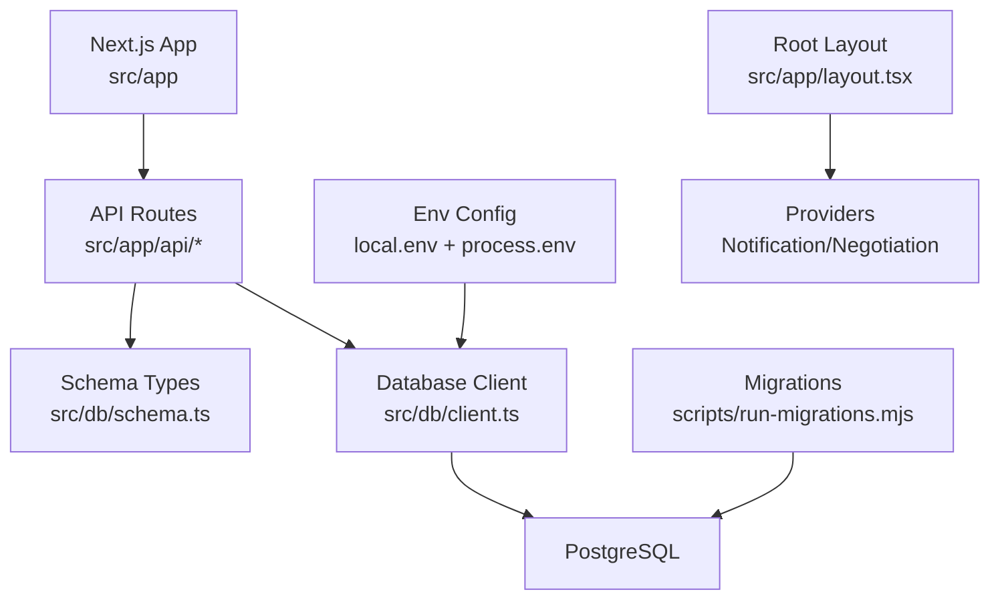
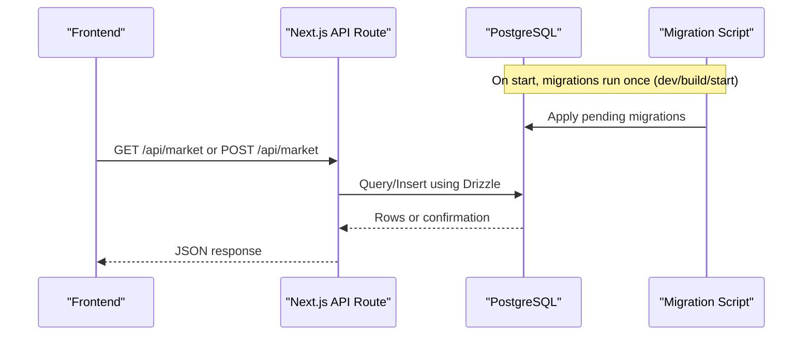
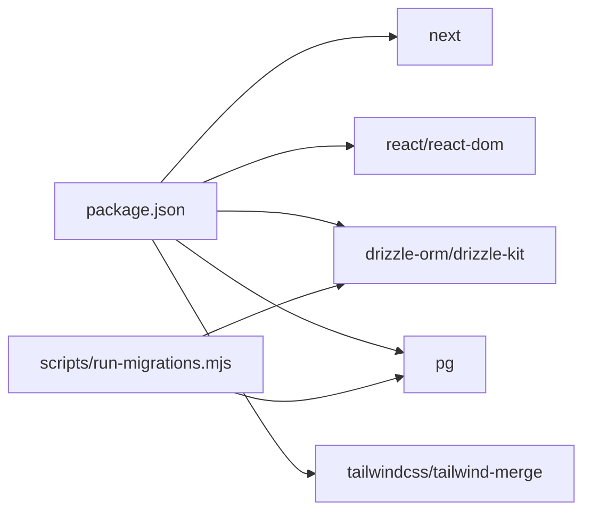

# Troubleshooting & FAQ

<cite>
**Referenced Files in This Document**
- [README.md](file://README.md)
- [package.json](file://package.json)
- [local.env](file://local.env)
- [drizzle.config.ts](file://drizzle.config.ts)
- [next.config.ts](file://next.config.ts)
- [src/db/client.ts](file://src/db/client.ts)
- [src/db/schema.ts](file://src/db/schema.ts)
- [scripts/run-migrations.mjs](file://scripts/run-migrations.mjs)
- [src/app/api/market/route.ts](file://src/app/api/market/route.ts)
- [src/app/api/campaigns/route.ts](file://src/app/api/campaigns/route.ts)
- [src/lib/db.ts](file://src/lib/db.ts)
- [src/app/layout.tsx](file://src/app/layout.tsx)
- [src/context/NotificationContext.tsx](file://src/context/NotificationContext.tsx)
</cite>

## Table of Contents
1. Introduction
2. Project Structure
3. Core Components
4. Architecture Overview
5. Detailed Component Analysis
6. Dependency Analysis
7. Performance Considerations
8. Troubleshooting Guide
9. Conclusion
10. Appendices

## Introduction
This document provides comprehensive troubleshooting and frequently asked questions for PortVille Market, covering development, deployment, and runtime issues. It includes step-by-step resolution guides, debugging techniques for frontend components, backend APIs, and database queries, environment configuration fixes, dependency conflict resolutions, performance tuning, browser compatibility guidance, mobile responsiveness checks, cross-platform considerations, escalation procedures, and community support resources.

## Project Structure
PortVille Market is a Next.js application with:
- Server-side API routes under src/app/api
- Database schema and client via Drizzle ORM and PostgreSQL
- Migrations executed at startup via a Node script
- Frontend layout and global providers for notifications and negotiation state
- Environment configuration through process.env and a local.env file for development

**Diagram sources**
- [src/app/api/market/route.ts:1-262](file://src/app/api/market/route.ts#L1-L262)
- [src/app/api/campaigns/route.ts:1-142](file://src/app/api/campaigns/route.ts#L1-L142)
- [src/db/client.ts:1-152](file://src/db/client.ts#L1-L152)
- [src/db/schema.ts:1-84](file://src/db/schema.ts#L1-L84)
- [scripts/run-migrations.mjs:1-67](file://scripts/run-migrations.mjs#L1-L67)
- [local.env:1-2](file://local.env#L1-L2)
- [src/app/layout.tsx:1-43](file://src/app/layout.tsx#L1-L43)

**Section sources**
- [README.md:1-37](file://README.md#L1-L37)
- [package.json:1-45](file://package.json#L1-L45)
- [next.config.ts:1-7](file://next.config.ts#L1-L7)

## Core Components
- Database client and schema:
  - Connection pooling and environment loading from local.env
  - Schema enforcement and table creation on startup
- API routes:
  - Market listing CRUD with social profile verification
  - Campaign listing and creation with filtering by user context
- Migrations:
  - Run migrations on dev/build/start with graceful handling when DB is unreachable in development
- Root layout and providers:
  - Global providers for notifications and negotiation state
  - Consistent theming and structure

**Section sources**
- [src/db/client.ts:1-152](file://src/db/client.ts#L1-L152)
- [src/db/schema.ts:1-84](file://src/db/schema.ts#L1-L84)
- [src/app/api/market/route.ts:1-262](file://src/app/api/market/route.ts#L1-L262)
- [src/app/api/campaigns/route.ts:1-142](file://src/app/api/campaigns/route.ts#L1-L142)
- [scripts/run-migrations.mjs:1-67](file://scripts/run-migrations.mjs#L1-L67)
- [src/app/layout.tsx:1-43](file://src/app/layout.tsx#L1-L43)

## Architecture Overview
The application uses Next.js serverless/node runtime for API routes that interact with a PostgreSQL database via Drizzle ORM. Migrations run before starting the app to ensure schema readiness. The root layout wraps pages with providers for shared UI state.

**Diagram sources**
- [scripts/run-migrations.mjs:1-67](file://scripts/run-migrations.mjs#L1-L67)
- [src/app/api/market/route.ts:1-262](file://src/app/api/market/route.ts#L1-L262)
- [src/app/api/campaigns/route.ts:1-142](file://src/app/api/campaigns/route.ts#L1-L142)
- [src/db/client.ts:1-152](file://src/db/client.ts#L1-L152)

## Detailed Component Analysis

### Database Client and Schema
- Loads DATABASE_URL from environment or local.env
- Creates a connection pool with max connections and idle timeout
- Ensures tables exist on startup; logs errors if initialization fails
- Exposes db and pool for API routes

Common issues:
- Missing DATABASE_URL leads to startup error
- Network errors during migration are tolerated in development mode
- Schema mismatch between code and DB can cause query failures

Resolution steps:
- Ensure DATABASE_URL is set correctly in environment or local.env
- Verify network access to PostgreSQL
- Re-run migrations and confirm schema matches src/db/schema.ts

**Section sources**
- [src/db/client.ts:10-59](file://src/db/client.ts#L10-L59)
- [src/db/client.ts:61-152](file://src/db/client.ts#L61-L152)
- [src/db/schema.ts:1-84](file://src/db/schema.ts#L1-L84)
- [scripts/run-migrations.mjs:8-38](file://scripts/run-migrations.mjs#L8-L38)
- [scripts/run-migrations.mjs:47-66](file://scripts/run-migrations.mjs#L47-L66)

### Market API Route
- GET returns market listings from DB or fallback empty array on error
- POST validates input, verifies social profile URL, computes metrics, and persists listing
- Gracefully handles DB unavailability by returning a fallback payload

Debugging tips:
- Check console warnings when DB is unavailable
- Validate profile URL format and supported platforms
- Inspect returned item fields for correct mapping

**Section sources**
- [src/app/api/market/route.ts:17-35](file://src/app/api/market/route.ts#L17-L35)
- [src/app/api/market/route.ts:37-162](file://src/app/api/market/route.ts#L37-L162)
- [src/app/api/market/route.ts:164-172](file://src/app/api/market/route.ts#L164-L172)
- [src/app/api/market/route.ts:174-262](file://src/app/api/market/route.ts#L174-L262)

### Campaigns API Route
- GET supports filters: created, joined, active; maps rows to consistent shape
- POST creates campaigns with defaults and returns mapped row
- Uses x-user-id header or query param for user context

Debugging tips:
- Confirm x-user-id presence for accurate filtering
- Validate required fields for campaign creation
- Inspect mapped fields like requiredPlatforms parsing

**Section sources**
- [src/app/api/campaigns/route.ts:10-44](file://src/app/api/campaigns/route.ts#L10-L44)
- [src/app/api/campaigns/route.ts:46-98](file://src/app/api/campaigns/route.ts#L46-L98)
- [src/app/api/campaigns/route.ts:100-142](file://src/app/api/campaigns/route.ts#L100-L142)

### Root Layout and Providers
- Wraps app with NotificationProvider and NegotiationProvider
- Sets metadata and consistent body classes for theming

Debugging tips:
- If notification counts do not update, check localStorage persistence and provider usage
- Ensure providers are mounted and no hydration mismatches occur

**Section sources**
- [src/app/layout.tsx:10-43](file://src/app/layout.tsx#L10-L43)
- [src/context/NotificationContext.tsx:22-146](file://src/context/NotificationContext.tsx#L22-L146)

## Dependency Analysis
Key runtime dependencies include Next.js, React, Drizzle ORM, PostgreSQL driver, and Tailwind CSS. Scripts rely on Node.js version constraints.

**Diagram sources**
- [package.json:15-43](file://package.json#L15-L43)
- [scripts/run-migrations.mjs:1-67](file://scripts/run-migrations.mjs#L1-L67)

**Section sources**
- [package.json:1-45](file://package.json#L1-L45)

## Performance Considerations
- Connection pooling:
  - Pool size and idle timeouts are configured; monitor for connection exhaustion under load
- API route efficiency:
  - Use dynamic = 'force-dynamic' where needed; avoid unnecessary re-renders on client
- Social profile verification:
  - External fetches can be slow; consider caching or rate-limiting strategies
- Database queries:
  - Limit result sets and use indexes where appropriate
- Build and dev scripts:
  - Migrations run on every start; ensure they complete quickly and handle unreachable DB gracefully in development

[No sources needed since this section provides general guidance]

## Troubleshooting Guide

### Environment Configuration Problems
Symptoms:
- Application fails to start due to missing DATABASE_URL
- Migrations skip or fail
- API routes return errors or fallback payloads

Resolutions:
- Set DATABASE_URL in your environment or local.env
- Ensure local.env is present and formatted correctly
- Verify Node.js and npm versions meet requirements
- For development without DB, expect migrations to skip with a warning

Steps:
1. Add DATABASE_URL to local.env or system environment
2. Restart dev server to apply changes
3. Confirm migrations run successfully or see expected development warning

**Section sources**
- [local.env:1-2](file://local.env#L1-L2)
- [src/db/client.ts:10-38](file://src/db/client.ts#L10-L38)
- [scripts/run-migrations.mjs:8-38](file://scripts/run-migrations.mjs#L8-L38)
- [package.json:5-13](file://package.json#L5-L13)

### Dependency Conflicts
Symptoms:
- Build errors related to incompatible versions
- Runtime errors due to mismatched types or modules

Resolutions:
- Align Node.js and npm versions per package.json engines
- Reinstall dependencies with a clean lockfile if necessary
- Avoid mixing package managers; stick to one consistently

Steps:
1. Check Node.js and npm versions against engines in package.json
2. Remove node_modules and reinstall
3. Run lint and build to validate

**Section sources**
- [package.json:5-13](file://package.json#L5-L13)
- [package.json:15-43](file://package.json#L15-L43)

### Database Connectivity and Migration Issues
Symptoms:
- Migration script exits with failure or skips in development
- API routes cannot read/write data
- Schema mismatch errors

Resolutions:
- Verify network reachability to PostgreSQL
- Ensure credentials in DATABASE_URL are correct
- Re-run migrations; inspect logs for specific SQL errors
- In development, unreachable DB will skip migrations but still allow app to start

Steps:
1. Test connectivity to PostgreSQL host and port
2. Update DATABASE_URL if credentials change
3. Run migrations manually or via npm scripts
4. Check console output for migration status

**Section sources**
- [scripts/run-migrations.mjs:47-66](file://scripts/run-migrations.mjs#L47-L66)
- [src/db/client.ts:61-152](file://src/db/client.ts#L61-L152)

### Frontend Debugging Techniques
- Notifications and cart counts:
  - Check localStorage entries for orders and offers
  - Ensure NotificationProvider is mounted and hooks are used within context
- Hydration warnings:
  - Review root layout and suppress hydration flags only when necessary
  - Ensure consistent initial state between server and client

Steps:
1. Open browser DevTools and inspect localStorage
2. Verify provider usage in components
3. Check console for hydration or context errors

**Section sources**
- [src/context/NotificationContext.tsx:22-146](file://src/context/NotificationContext.tsx#L22-L146)
- [src/app/layout.tsx:20-43](file://src/app/layout.tsx#L20-L43)

### Backend API Debugging Techniques
- Market API:
  - Validate profile URL and supported platforms
  - Inspect console warnings when DB is unavailable
  - Confirm POST payload contains required fields
- Campaigns API:
  - Provide x-user-id header or userId query parameter for filtering
  - Validate required fields for campaign creation

Steps:
1. Use browser network tab to inspect request/response
2. Log server-side console messages for errors and warnings
3. Test with minimal payloads to isolate issues

**Section sources**
- [src/app/api/market/route.ts:37-162](file://src/app/api/market/route.ts#L37-L162)
- [src/app/api/market/route.ts:174-262](file://src/app/api/market/route.ts#L174-L262)
- [src/app/api/campaigns/route.ts:46-98](file://src/app/api/campaigns/route.ts#L46-L98)
- [src/app/api/campaigns/route.ts:100-142](file://src/app/api/campaigns/route.ts#L100-L142)

### Browser Compatibility and Mobile Responsiveness
- Use responsive design utilities (Tailwind) and test across devices
- Ensure fonts and assets load correctly
- Validate form inputs and interactions on touch devices

Recommendations:
- Test on multiple browsers and screen sizes
- Use device emulation in DevTools
- Verify accessibility attributes and keyboard navigation

[No sources needed since this section provides general guidance]

### Cross-Platform Considerations
- Ensure scripts and paths work on Windows/macOS/Linux
- Validate environment variable loading from local.env
- Confirm Node.js version consistency across environments

[No sources needed since this section provides general guidance]

### Logging Strategies
- Server-side logging:
  - Console.warn and console.error are used for non-fatal and fatal issues
  - Migration script logs success or failure details
- Client-side logging:
  - Context and hooks log parse errors for localStorage data

Best practices:
- Include contextual information in logs (e.g., user ID, endpoint)
- Avoid logging sensitive data
- Centralize logging if possible

**Section sources**
- [src/app/api/market/route.ts:164-172](file://src/app/api/market/route.ts#L164-L172)
- [src/app/api/market/route.ts:257-262](file://src/app/api/market/route.ts#L257-L262)
- [src/app/api/campaigns/route.ts:94-98](file://src/app/api/campaigns/route.ts#L94-L98)
- [src/app/api/campaigns/route.ts:137-142](file://src/app/api/campaigns/route.ts#L137-L142)
- [scripts/run-migrations.mjs:47-66](file://scripts/run-migrations.mjs#L47-L66)
- [src/context/NotificationContext.tsx:30-62](file://src/context/NotificationContext.tsx#L30-L62)

### Escalation Procedures
- If migrations repeatedly fail:
  - Collect database logs and connection details
  - Verify schema drift between code and DB
- If API routes return unexpected results:
  - Capture request payloads and responses
  - Check server logs for warnings/errors
- If performance issues persist:
  - Profile database queries and external fetch calls
  - Monitor connection pool usage

[No sources needed since this section provides general guidance]

### Community Support Resources
- Next.js documentation and forums
- Drizzle ORM documentation and GitHub discussions
- PostgreSQL documentation and community support channels

[No sources needed since this section provides general guidance]

## Conclusion
This guide consolidates common issues and resolutions for PortVille Market across environment setup, database operations, API behavior, and frontend state management. Use the provided diagrams and section references to locate relevant code and understand how components interact. For complex problems, follow the escalation procedures and leverage community resources.

## Appendices

### Frequently Asked Questions

- Why does my app start without a database in development?
  - Migrations skip with a warning when the database is unreachable in development mode.

- How do I add a new database table?
  - Define the table in src/db/schema.ts and run migrations to apply changes.

- What headers should I send to identify users?
  - Use x-user-id header or userId query parameter where applicable.

- How do I debug failed social profile verification?
  - Ensure the URL points to a supported platform and includes a valid handle.

- Where can I find the project’s scripts and commands?
  - See package.json for dev, build, start, and lint scripts.

**Section sources**
- [scripts/run-migrations.mjs:28-38](file://scripts/run-migrations.mjs#L28-L38)
- [src/db/schema.ts:1-84](file://src/db/schema.ts#L1-L84)
- [src/app/api/campaigns/route.ts:46-98](file://src/app/api/campaigns/route.ts#L46-L98)
- [src/app/api/market/route.ts:37-162](file://src/app/api/market/route.ts#L37-L162)
- [package.json:9-13](file://package.json#L9-L13)